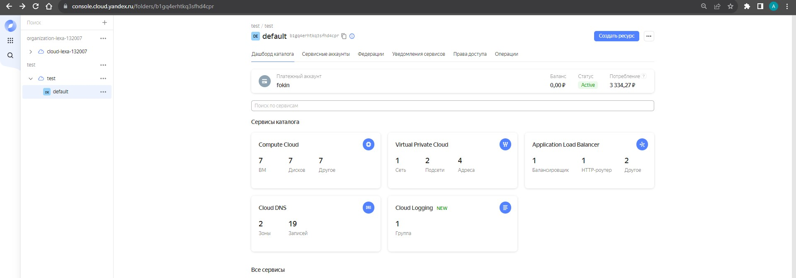

#  Дипломная работа по профессии «Системный администратор» - Алексей Фокин

Содержание
==========
* [Задача](#Задача)
* [Инфраструктура](#Инфраструктура)
    * [Сайт](#Сайт)
    * [Мониторинг](#Мониторинг)
    * [Логи](#Логи)
    * [Сеть](#Сеть)
    * [Резервное копирование](#Резервное-копирование)
    * [Дополнительно](#Дополнительно)
* [Выполнение работы](#Выполнение-работы)
* [Критерии сдачи](#Критерии-сдачи)
* [Как правильно задавать вопросы дипломному руководителю](#Как-правильно-задавать-вопросы-дипломному-руководителю) 

---------
## Задача
Ключевая задача — разработать отказоустойчивую инфраструктуру для сайта, включающую мониторинг, сбор логов и резервное копирование основных данных. Инфраструктура должна размещаться в [Yandex Cloud](https://cloud.yandex.com/).

**Примечание**: в этом дипломном задании используется система мониторинга Prometheus. Вместо Prometheus вы можете использовать Zabbix. Дипломное задание с использованием Zabbix находится по [ссылке](https://github.com/netology-code/sys-diplom/blob/diplom-zabbix/README.md).

## Инфраструктура
Для развёртки инфраструктуры используйте Terraform и Ansible. 

### Сайт
Создайте две ВМ в разных зонах, установите на них сервер nginx, если его там нет. ОС и содержимое ВМ должно быть идентичным, это будут наши веб-сервера.

Используйте набор статичных файлов для сайта. Можно переиспользовать сайт из домашнего задания.

Создайте [Target Group](https://cloud.yandex.com/docs/application-load-balancer/concepts/target-group), включите в неё две созданных ВМ.

Создайте [Backend Group](https://cloud.yandex.com/docs/application-load-balancer/concepts/backend-group), настройте backends на target group, ранее созданную. Настройте healthcheck на корень (/) и порт 80, протокол HTTP.

Создайте [HTTP router](https://cloud.yandex.com/docs/application-load-balancer/concepts/http-router). Путь укажите — /, backend group — созданную ранее.

Создайте [Application load balancer](https://cloud.yandex.com/en/docs/application-load-balancer/) для распределения трафика на веб-сервера, созданные ранее. Укажите HTTP router, созданный ранее, задайте listener тип auto, порт 80.

Протестируйте сайт
`curl -v <публичный IP балансера>:80` 

### Мониторинг
Создайте ВМ, разверните на ней Prometheus. На каждую ВМ из веб-серверов установите Node Exporter и [Nginx Log Exporter](https://github.com/martin-helmich/prometheus-nginxlog-exporter). Настройте Prometheus на сбор метрик с этих exporter.

Создайте ВМ, установите туда Grafana. Настройте её на взаимодействие с ранее развернутым Prometheus. Настройте дешборды с отображением метрик, минимальный набор — Utilization, Saturation, Errors для CPU, RAM, диски, сеть, http_response_count_total, http_response_size_bytes. Добавьте необходимые [tresholds](https://grafana.com/docs/grafana/latest/panels/thresholds/) на соответствующие графики.

### Логи
Cоздайте ВМ, разверните на ней Elasticsearch. Установите filebeat в ВМ к веб-серверам, настройте на отправку access.log, error.log nginx в Elasticsearch.

Создайте ВМ, разверните на ней Kibana, сконфигурируйте соединение с Elasticsearch.

### Сеть
Разверните один VPC. Сервера web, Prometheus, Elasticsearch поместите в приватные подсети. Сервера Grafana, Kibana, application load balancer определите в публичную подсеть.

Настройте [Security Groups](https://cloud.yandex.com/docs/vpc/concepts/security-groups) соответствующих сервисов на входящий трафик только к нужным портам.

Настройте ВМ с публичным адресом, в которой будет открыт только один порт — ssh. Настройте все security groups на разрешение входящего ssh из этой security group. Эта вм будет реализовывать концепцию bastion host. Потом можно будет подключаться по ssh ко всем хостам через этот хост.

### Резервное копирование
Создайте snapshot дисков всех ВМ. Ограничьте время жизни snaphot в неделю. Сами snaphot настройте на ежедневное копирование.

## Выполнение работы

Сервера и инфраструктура в  [Yandex Cloud](https://cloud.yandex.com/) создана при помощи terraform и ansible. Операционной системой для виртуальных машин выбрана Ubuntu 22.04 LTS.

При помощи terraform разворачиваем сервера.

Все конфигурационные файлы terraform ниже.

 [terraform](terraform_final)

В облаке развертываются виртуальные машины:

web1, web2, prometheus, grafana, elasticsearch, kibana, bastion.

 
 

 Для доступа на наши сервера используем сервер bstion

 пробрасываем им ключи доступа.

